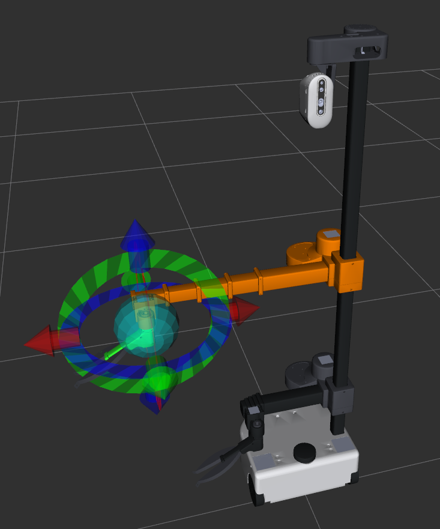
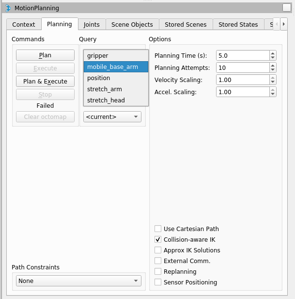
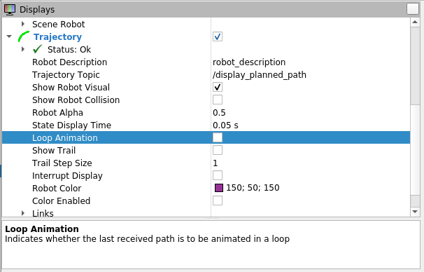
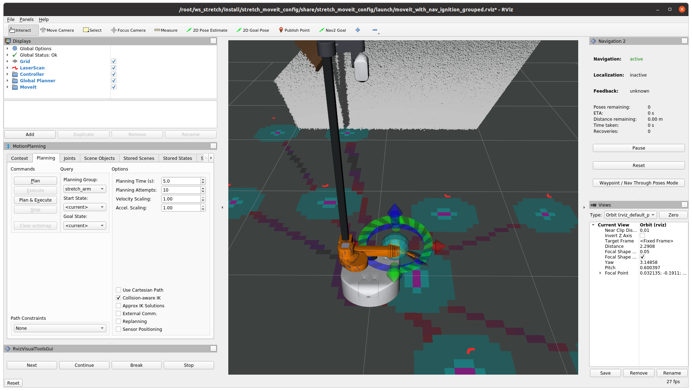
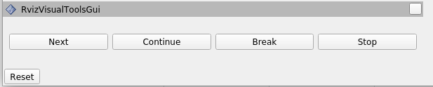

# Mobile Manipulation with MoveIt 2 and Stretch 

This documentation is for the [ROS World 2021](https://roscon.ros.org/world/2021/) tutorial from [PickNik](https://picknik.ai/) and [Hello Robot](https://hello-robot.com/). You'll learn how to use [MoveIt 2](https://moveit.ros.org/) for mobile manipulation with the [Stretch RE1 mobile manipulator](https://hello-robot.com/product) from Hello Robot.

## Table of Contents

+ [Software Installation](#software_install)
  + [Linux Installation (with Docker)](#linux_docker_install)
  + [Updating the Docker Image](#docker_update)
  + [Linux Installation (Source)](#linux_source_install)
  + [Windows Installation](#windows_install)
  + [MacOS Installation](#macos_install)
+ [Guided Explorations](#guided_explorations)
  + [stretch_moveit_config Demo](#moveit_config_demo)
  + [Ignition Demo World](#ignition_demo)
  + [Pick and Place with MoveIt Task Constructor](#task_constructor_demo)
  + [Pick and Place with Whole Body Planning](#whole_body_planning)
  + [Editing the Source Code During the Workshop](#editing_source_code)


<a name="software_install"/>

# Software Installation

Prior to the workshop, you need to install software in order to actively try things out. **We strongly recommend the Docker-based installation**, but we also provide instructions for installation from source.

<a name="linux_docker_install"/>

## Linux Installation (with Docker)

### Install Docker

Install docker, following the [official installation steps](https://docs.docker.com/engine/install/ubuntu/#install-using-the-repository) and verify your installation. Follow the instructions under "Install using the repository" and the stable release.

### Docker post-install steps

Follow the [official post-installation steps](https://docs.docker.com/engine/install/linux-postinstall/#manage-docker-as-a-non-root-user) for Linux allow non-root users to manage dockers and verify your post installation. Be sure to reboot after running the commands.

### Check if you have an Nvidia GPU

Now, check if your machine has an Nvidia GPU. If it does, you need to follow the Docker Nvidia installation instructions. **The non-Nvidia installation will fail if you have an Nvidia GPU.**

Install nvidia-docker2 if you have an Nvidia GPU. Follow the [official instructions](https://docs.nvidia.com/datacenter/cloud-native/container-toolkit/install-guide.html#setting-up-nvidia-container-toolkit). Install nvidia-docker2 and verify your installation.

### Getting Started with a Docker Container for Stretch

We provide a pre-built docker image and a set of scripts to easily get you up and running with Stretch on docker! To get your docker running with UI and networking enabled:

1\. Fetch our start_docker script. This fetches the script to your current directory. Remember where it is so you can come back to it.

```bash
wget https://raw.githubusercontent.com/hello-robot/stretch_ros2/ros_world2021/docker/scripts/start_docker.sh
```

2\. Start your container from our pre-built image

with an nvidia-gpu:

```bash
chmod +x start_docker.sh && \
./start_docker.sh stretch_roscon ghcr.io/hello-robot/stretch_ros2:rosworld2021
```

without an nvidia-gpu:

```bash
chmod +x start_docker.sh && \
./start_docker.sh stretch_roscon ghcr.io/hello-robot/stretch_ros2:rosworld2021 nogpu
```
You should now be in the `~/ws_stretch/src/` directory. If you type `ls`, you should see a number of directories, including `stretch_ros2` and `stretch_moveit_plugins`.  

You can access the same container from multiple terminals. For example, you can open a new terminal and run `./start_docker.sh stretch_roscon` to access a running container.

You can leave the container at any time by typing `exit` in a terminal. To find out if a container is running, you can open a new terminal and type `docker ps`. 

3\. Test the container by running a simulation of the robot Stretch. First, make sure you are accessing the container via a terminal.

Now you can test the container by bringing up Stretch in Ignition Gazebo by issuing the following set of commands inside your container:

```bash
ros2 launch stretch_ignition ignition.launch.py
```

Congratulations! You brought up Stretch in Ignition Gazebo! Now you should be seeing Stretch in Ignition Gazebo with an empty world around it:


<a name="docker_update"/>

## Updating the Docker Image

If you would like to update your docker image you can start by pulling the latest docker image with

```bash
docker pull ghcr.io/hello-robot/stretch_ros2:rosworld2021
```

and remove the previous container so you can start a new one with the same name with the following command with NVIDIA GPU:

```bash
docker container rm stretch_roscon && ./start_docker.sh stretch_roscon ghcr.io/hello-robot/stretch_ros2:rosworld2021
```

or without an NVIDIA gpu:

```bash
docker container rm stretch_roscon && ./start_docker.sh stretch_roscon ghcr.io/hello-robot/stretch_ros2:rosworld2021 nogpu
```
<a name="linux_source_install"/>

## Linux Installation (Source)

The following instructions assume you have an Ubuntu 20.04 based installation of Linux.

### Install ROS 2 Galactic

We recommend following the [official instructions](https://docs.ros.org/en/galactic/Installation/Ubuntu-Install-Debians.html) to install ROS 2 Galactic Desktop installation. 

### Install Ignition Fortress

  ```bash
  sudo apt-get install -y wget python3-pip lsb-release gnupg curl python3-vcstool python3-colcon-common-extensions git && \
  sh -c 'echo "deb http://packages.osrfoundation.org/gazebo/ubuntu-stable `lsb_release -cs` main" > /etc/apt/sources.list.d/gazebo-stable.list'  && \
  wget http://packages.osrfoundation.org/gazebo.key -O - | apt-key add -  && \
  sudo apt-get update  && \
  sudo apt-get install -y libignition-gazebo6-dev
  ```

### Install MoveIt 2 and Stetch ROS 2 for Galactic

#### Install Build Tools

  ```bash
  # Make sure everything is up to date
  sudo apt update && \
  sudo apt dist-upgrade && \
  rosdep update
  ```

  ```bash
  # Install some build tools for source building
  sudo apt install -y \
  build-essential \
  cmake \
  git \
  libbullet-dev \
  python3-flake8 \
  python3-pip \
  python3-pytest-cov \
  python3-rosdep \
  python3-setuptools \
  clang-format-10
  ```

  ```bash
  # Install some pip packages needed for testing
  python3 -m pip install -U \
  argcomplete \
  flake8-blind-except \
  flake8-builtins \
  flake8-class-newline \
  flake8-comprehensions \
  flake8-deprecated \
  flake8-docstrings \
  flake8-import-order \
  flake8-quotes \
  pytest-repeat \
  pytest-rerunfailures \
  pytest
  ```

#### Create Workspace and Source

Issue the following commands one by one to create your workspace
  ```bash
  export COLCON_WS=~/ws_stretch
  mkdir -p $COLCON_WS/src
  cd $COLCON_WS/src
  ```

#### Download Source Code

Issue the following commands one by one to download source code for MoveIt 2 and Stretch ROS World Workshop

  ```bash
  # Download MoveIt 2
  git clone https://github.com/ros-planning/moveit2.git -b main
  for repo in moveit2/moveit2.repos $(f="moveit2/moveit2_$ROS_DISTRO.repos"; test -r $f && echo $f); do vcs import < "$repo"; done
  # Download Stretch ROS 2 for ROS World
  git clone https://github.com/hello-robot/stretch_ros2.git -b ros_world2021
  vcs import < stretch_ros2/stretch_ros2.repos
  # Download dependencies
  export IGNITION_VERSION=fortress
  rosdep install -r --from-paths . --ignore-src --rosdistro $ROS_DISTRO -y
  ```

#### Build Source Code

Issue the following commands one by one build the source code

  ```bash
  cd $COLCON_WS
  colcon build --event-handlers desktop_notification- status- --cmake-args -DCMAKE_BUILD_TYPE=Release
  ```

#### Source Your Workspace and Register Gazebo Path

Issue the following commands one by one to make sure your environment is all set up and ready to work. We recommend adding these commands to your .bashrc file to avoid repeated issuing of these commands:

  ```bash
  export COLCON_WS=~/ws_stretch
  source /opt/ros/galactic/setup.bash
  source $COLCON_WS/install/setup.bash
  export IGNITION_VERSION=fortress
  export IGN_GAZEBO_RESOURCE_PATH=$COLCON_WS/src/stretch_ros:$COLCON_WS/src/realsense-ros:$COLCON_WS/src/aws-robomaker-small-house-world/models
  ```

<a name="windows_install"/>

## Windows Installation

We recommend installing an Ubuntu 20.04 in a Virtual Machine and following the installation instructions for Linux Installation (with Docker).

<a name="macos_install"/>

## MacOS Installation

We recommend installing an Ubuntu 20.04 in a Virtual Machine and following the installation instructions for Linux Installation (with Docker).

<a name="guided_explorations"/>


# Guided Explorations

The ROS World tutorial will include several guided explorations, which we describe below.

<a name="moveit_config_demo"/>

## stretch_moveit_config Demo

* Make sure you don't have anything running in your docker terminal and issue the following command:

  ```bash
  ros2 launch stretch_moveit_config demo.launch.py
  ```

* Show how to plan from current state to (1) random valid goal state or (2) a specific state by moving the interactive marker. The latter may not always work, because some planning groups are kinematically very constrained.



* Repeat the previous step for the `stretch_arm` and `mobile_base_arm` groups.

 

* Turn on "Query Start State" by checking the checkbox in the Displays panel under "Motion Planning > Planning Request".

 

* Turn on "Loop animation" by checking the checkbox in the Displays panel under "Trajectory."

 

* Explain structure of `stretch_moveit_config`; show contents of some configuration files and maybe SRDF/URDF.

<a name="ignition_demo"/>

## Ignition Demo World

* Run the following commands in three different terminal windows. In each terminal, the commands start by running our docker script to connect to the same container instance. 

  ```bash
  # Terminal 1
  ./start_docker.sh stretch_roscon
  ros2 launch stretch_ignition ignition.launch.py
  ```
  ```bash
  # Terminal 2
  ./start_docker.sh stretch_roscon
  ros2 launch stretch_moveit_config demo_ignition.launch.py
  ```
  ```bash
  # Terminal 3
  ./start_docker.sh stretch_roscon
  ros2 launch stretch_roscon_demos move_group_interface_demo.launch.py
  ```
  
After executing these commands, you should see the simulation window (Ignition) and an RViz window that displays sensor information. 




You will press the `Next` button in the RViz window to make the robot move through a series of actions. 

 

<a name="task_constructor_demo"/>

## Pick and Place with MoveIt Task Constructor

* Run the following commands in two different terminal windows:

  ```bash
  # Terminal 1
  ros2 launch pick_place_task demo.launch.py
  # Terminal 2
  ros2 launch pick_place_task pick_place_demo.launch.py 
  ```

* Explain MTC panel. Show different solutions.
* Explain structure of the code.


<a name="whole_body_planning"/>

## Pick and Place with Whole Body Planning

* Run the following commands in two different terminal windows:

  ```bash
  # Terminal 1
  ros2 launch stretch_ignition ignition.launch.py aws:=true
  # Terminal 2
  ros2 launch stretch_moveit_config demo_ignition.launch.py
  ```

<a name="editing_source_code"/>

## Editing the Source Code During the Workshop

Our docker image comes with a pre-built installation of vim, nano and emacs. You can also install your editor of choice via apt-get.
