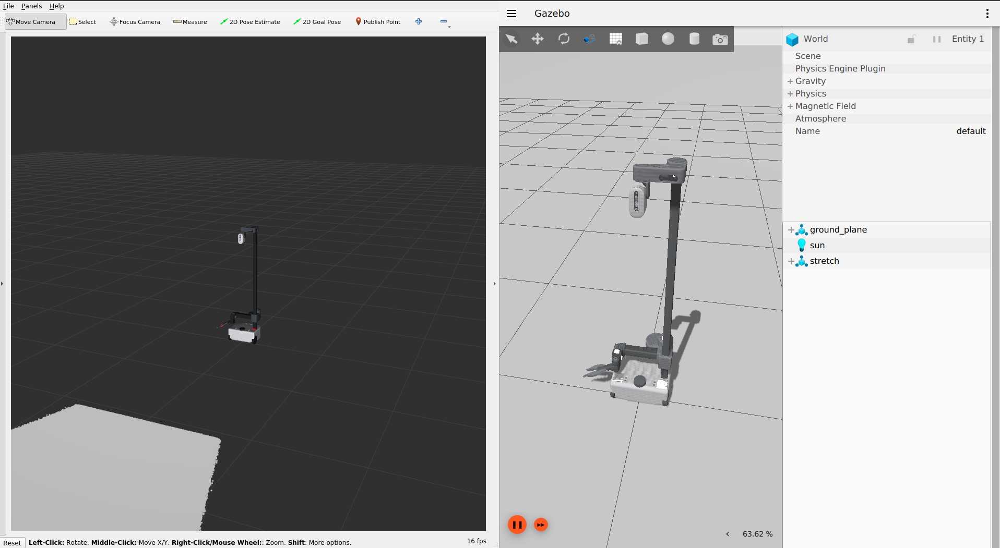
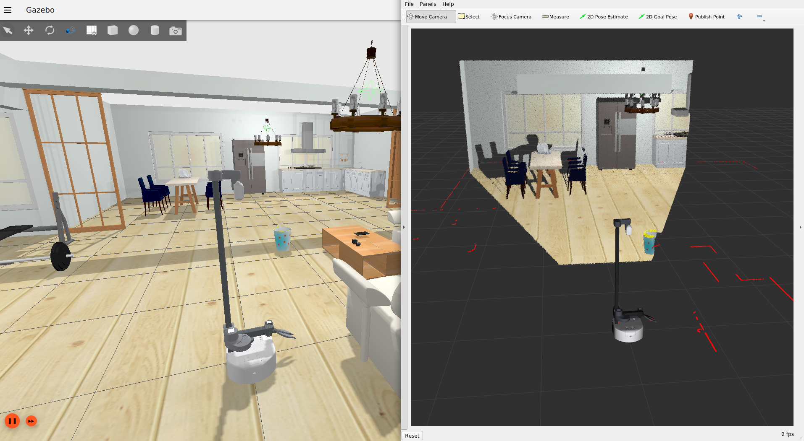
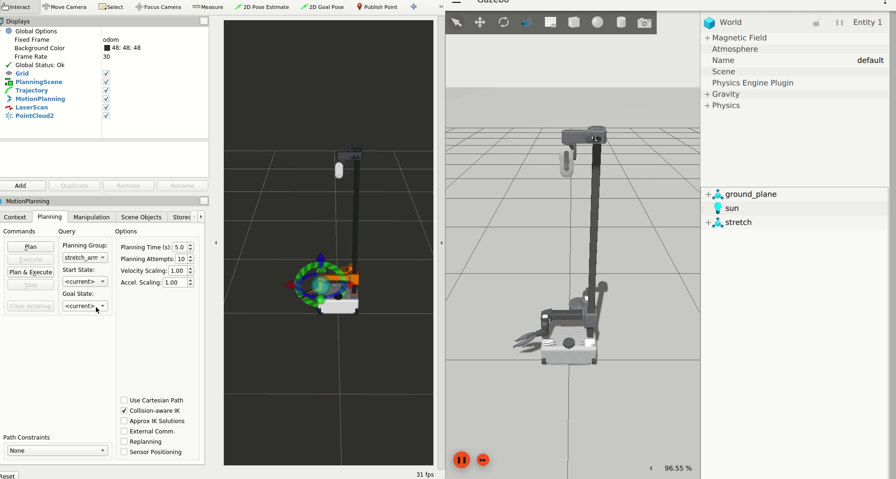

## Overview

*stretch_ignition* is an implementation of simulating a Stretch robot with [Ignition Gazebo](https://ignitionrobotics.org/) simulator.

## Details

The *rviz directory* contains an rviz file that is used for visualizing sensors on rviz with a default configuration.

The *world* directory contains two different [sdf world files](http://sdformat.org/spec?ver=1.6&elem=world). These files loads Ignition physics and enables sensor plugins to work with igtnition

* empty_world.sdf: An empty world instance with LIDAR, IMU and Magnetometer sensor plugins loaded
* aws_small_house.sdf: A playground for Stretch with multiple objects to play with. A modified version of [aws_robomaker_small_house_world](https://github.com/aws-robotics/aws-robomaker-small-house-world), where it is ported to Ignition, and more objects are added. This world file also includes the same sensor plugins with empty_world.

The *launch* directory contains a single launch file *ignition.launch* which spawns the robot with all the sensors ready to use and ignition's internal joint trajectory controllers up and running to control each joint on the robot. The following plugins are loaded as part of this launch file:

* [libignition-gazebo-joint-state-publisher-system.so](https://ignitionrobotics.org/api/gazebo/5.0/classignition_1_1gazebo_1_1systems_1_1JointStatePublisher.html): Publishes joint states
* [libignition-gazebo-diff-drive-system.so](https://ignitionrobotics.org/api/gazebo/5.0/classignition_1_1gazebo_1_1systems_1_1DiffDrive.html): Enables the robot to take *cmd_vel* commands and drives the base
* [libignition-gazebo-joint-trajectory-controller-system.so](https://ignitionrobotics.org/api/gazebo/5.0/classignition_1_1gazebo_1_1systems_1_1JointTrajectoryController.html): Specifies PID controllers for each joint except the wheel joints (which are drive by diff-drive system) and enables robot to subscribe and execute `joint_trajectory` commands.
* Sensors: Various sensor plugins with noises and parameters configured such that they represent the noise values from the sensor's datahseet. Sensors inlcuded here are base and wrist IMU, LIDAR and Realsense D435i. Note that being a depth camera Realsense D435i can affect decrease simulation's realtime capabilities. Consider removing it by setting *realsense* parameter in *stretch_description.xacro* to false if you do not use it. Additionally you can disable the additional IR and color camera topics without depth information by setting *realsense_extra_topics* to false in *stretch_ignition.xacro*

All these plugins can be found in *stretch_ignition_plugins.xacro* that is located under *urdf* directory of *stretch_description* package along with other xacro files.

<!-- Launch file parameters here -->

*ignition.launch.py* contains three different launch parameters that can be set from the command line:

* `use_sim_time`: If true, use simulated clock from the Ignition simulator instead of real time. Defaults to true.
* `rviz`: If true, pop up an rviz instance to ease sensor visualization. Defaults to false.
* `aws`: If true, spawn an aws_robomaker_small_house_world instance with plenty of objects to play around, else spawns an empty world instead. Defaults to false.

## Ignition Sensors vs Stretch Sensors

|         Sensor        |       Gazebo       |       Stretch      |       Notes       |
|:---------------------:|:------------------:|:------------------:|:-----------------:|
|         LIDAR         | :heavy_check_mark: | :heavy_check_mark: |                   |
|        Base IMU       | :heavy_check_mark: | :heavy_check_mark: |                   |
|  Wrist Accelerometer  | :heavy_check_mark: | :heavy_check_mark: | Modeled as an IMU |
|    Realsense D435i    | :heavy_check_mark: | :heavy_check_mark: |                   |
| Respeaker (Mic Array) |         :x:        | :heavy_check_mark: |                   |
|     Cliff Sensors     |         :x:        | :heavy_check_mark: |                   |

*Notes:* Although there is no microphone in Gazebo, Respeaker can be represented with a ROS node that accesses compputer's microphone. Cliff sensors are not modeled but they can also be represented as 1D LIDAR sensors. See LIDAR definition in *stretch_gazebo.urdf.xacro* file.

## Setup

Install Ignition Edifice binaries following [this document](https://ignitionrobotics.org/docs/edifice/install_ubuntu)

*Import note on Ignition:*

Ignition wants the following environment variables to set to correctly compile ros_ign (a dependecny of stretch_ignition) and launch the robot correctly with AWS world in the next steps. Consider adding these lines to your bashrc to avoid writing them again in each new terminal instance.

```bash
    export IGNITION_VERSION=edifice
    # Please use full absolute paths instead of $COLCON_WS below (for eg: /root/ws_stretch/src/stretch_ros)
    export IGN_GAZEBO_RESOURCE_PATH="$COLCON_WS/src/stretch_ros:/$COLCON_WS/src/realsense-ros:/$COLCON_WS/src/aws-robomaker-small-house-world/models"
```

Build and source moveit2 from source using [this instructions](https://moveit.ros.org/install-moveit2/source/). Then clone stretch_ros to your colcon workspace. Finally install dependencies and build the packages, with the following set of commands:

```bash
    source ~/ws_moveit/install/setup.bash
    cd $COLCON_WS/src
    wget https://raw.githubusercontent.com/PickNikRobotics/stretch_ros/ros2/stretch_ros.repos
    vcs import < stretch_ros.repos
    rosdep install -r --from-paths . --ignore-src --rosdistro foxy -y
    cd $COLCON_WS
    colcon build --event-handlers desktop_notification- status- --cmake-args -DCMAKE_BUILD_TYPE=Release
```

## Ignition - Moveit Controllers vs stretch_core

At the time of writing this package *ros2_control* has not been ported to Ignition. Thus, actuators are defined as afore-mentioned Ignition controllable objects. Moveit is configured to use five different action servers to control the body parts of stretch in Ignition through the srdf file in *stretch_moveit_config* package. See the section below about moveit for details. Please note that this behaviour is different than *stretch_core* as it works with a single Python interface to control all the joints.

## Spawning Stretch in Ignition with Empty World

```bash
    # Terminal 1:
    ros2 launch stretch_ignition ignition.launch.py rviz:=true
    # Terminal 2:
    ros2 run teleop_twist_keyboard teleop_twist_keyboard
```

This will launch an Rviz instance that visualizes the sensors and an empty world in Ignition with Stretch and load all the controllers. Although, the base will be able to move with the keyboard teleop comamnds, the teleop won't give joint trajectory commands to arm, head or gripper. To move these joints see the next section about *Running Ignition with MoveIt2 and Stretch*.



## Spawning Stretch in Ignition with Small House World

```bash
    # Terminal 1:
    ros2 launch stretch_ignition ignition.launch.py rviz:=true aws:=true
    # Terminal 2:
    ros2 run teleop_twist_keyboard teleop_twist_keyboard
```


This will launch an Rviz instance that visualizes the sensors and an AWS small house world in Ignition with Stretch and load all the controllers. Although, the base will be able to move with the joystick comamnds, the joystick won't give joint trajectory to arm, head or gripper. To move these joints see the next section about *Running Ignition with MoveIt2 and Stretch*.

## Running Ignition with MoveIt2 and Stretch

```bash
    # Terminal 1:
    ros2 launch stretch_ignition ignition.launch.py
    # Terminal 2:
    ros2 launch stretch_moveit_config demo_ignition.launch.py
```

This will launch an Rviz instance that visualizes the joints with markers and an empty world in Ignition with Stretch and load all the controllers. There are pre-defined positions for each joint group for demonstration purposes. There are five joint groups, namely *stretch_arm*, *gripper*, *position*, *mobile_base_arm* and *stretch_head* that can be controlled individually via Motion Planning Rviz plugin. Start and goal positions for joints can be selected similar to [this moveit tutorial](https://ros-planning.github.io/moveit_tutorials/doc/quickstart_in_rviz/quickstart_in_rviz_tutorial.html#choosing-specific-start-goal-states). A few notes to be kept in mind:

* Planning group can be changed via *Planning Group* drop down in Planning tab of Motion Planning Rviz plugin.
* Pre-defined start and goal states can be speciified in *Start State* and *Goal State* drop downs in Planning tab of Motion Planning Rviz plugin.  
* *stretch_gripper* group does not show markers, and is intended to be controlled via the joints tab that is located in the very right of Motion Planning Rviz plugin.
* When planning with *stretch_head* group make sure you select *Approx IK Solutions* in Planning tab of Motion Planning Rviz plugin.
* Using virtual joints ROS2 and Moveit2 is now capable of making plans for differential drive mobile bases. See [this tutorial](http://moveit2_tutorials.picknik.ai/doc/mobile_base_arm/mobile_base_arm_tutorial.html) for a detailed overview of this new feature.



*Note*: All the tests for this package has been done with the binary release of Ignition Edifice on Ubuntu 20.04, using ROS2 Foxy.
